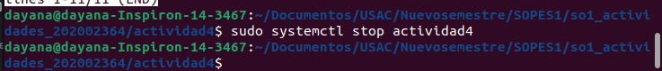

*Sistemas Operativos 1*  
*Seccion N*  
*Dayana Alejandra Reyes Rodríguez*  
*202002364*  
# Actividad 4  

Se tienen 2 archivos:  
- actividad4.sh
- actividad4.service  


## Instalacion  
Se debe de comprobar que el script tenga los permisos necesarios  
  

Para instalar el servicio se debe copiar el archivo actividad4.service en el directorio de unidades de systemd  

```bash
sudo cp actividad4.service /etc/systemd/system/  
```  
 
  
Luego, se recargan los servicios de systemd para que reconozcan el nuevo servicio  
```bash
sudo systemctl daemon-reload    
```  
 
# Uso  
Se inicia el servicio "actividad4"  
```bash
sudo systemctl start actividad4      
```  
  
Se verifica el estado del servicio para asegurar que esté en ejecución  
```bash
sudo systemctl status actividad4        
```  
  

Para detener el servicio en ejecución  
```bash
sudo systemctl stop actividad4       
```  
  